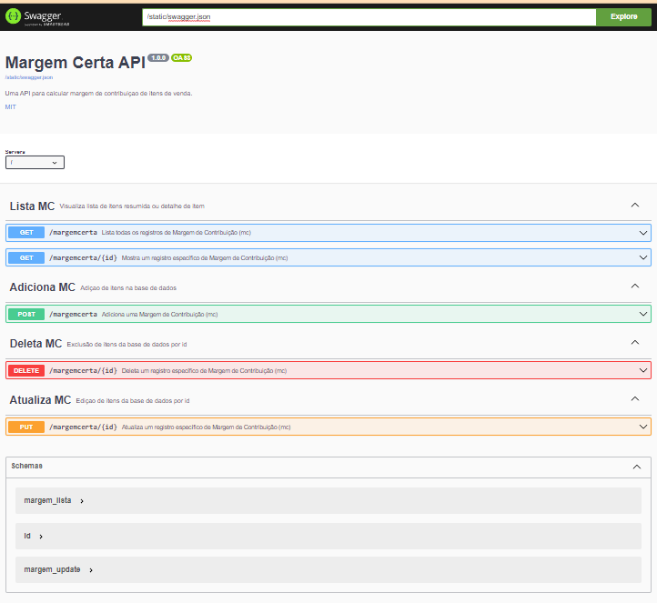
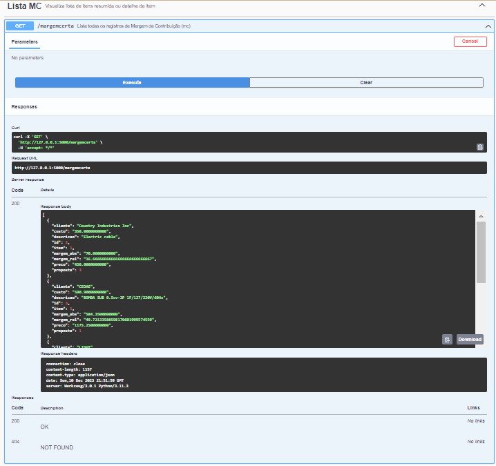
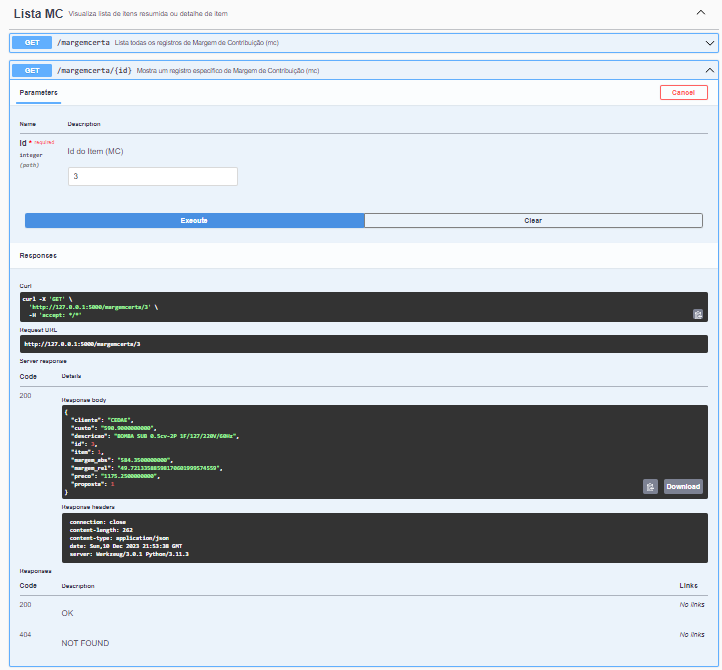
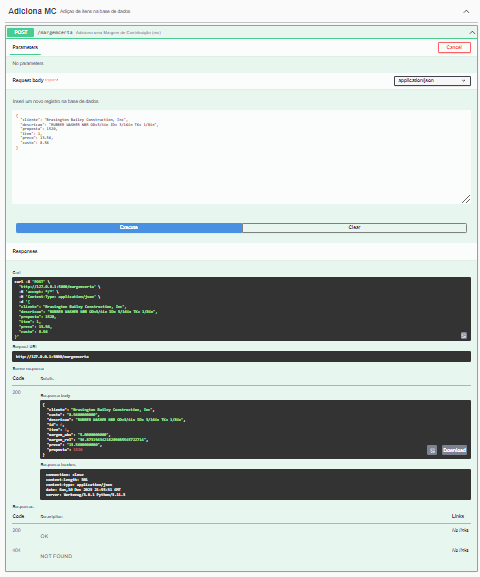
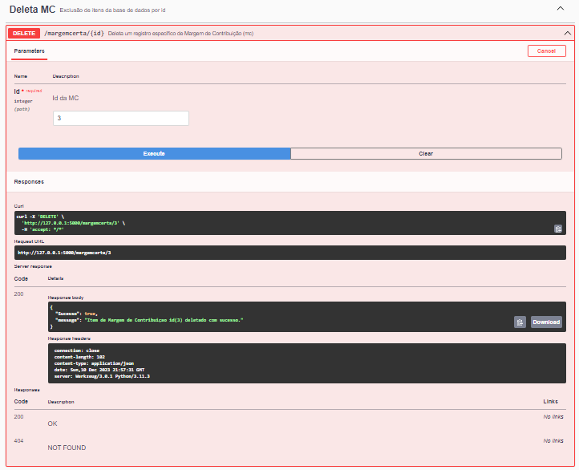

# API Margem Certa!

## Índice

- [Sobre](#sobre)
- [Instalação](#instalação)
- [Uso](#uso)
- [Endpoints](#endpoints)
- [Exemplos](#exemplos)
- [Contribuição](#contribuição)
- [Licença](#licença)

## Sobre

Esta API destina-se a uma aplicação que calcula a Margem de Contribuição de itens de comercializados por uma empresa.
A margem de contribuição é um conceito financeiro que representa a diferença entre as receitas totais obtidas com a venda de produtos ou serviços e os custos variáveis associados à produção ou prestação desses produtos ou serviços. Em outras palavras, é o valor que contribui para cobrir os custos fixos e, eventualmente, gerar lucro.

A fórmula básica da margem de contribuição é:

$$\ Margem de Contribuição = Receitas Totais - Custos Varriáveis Totais$$

Onde:

- **Receitas Totais** são as vendas totais geradas pela empresa.

- **Custos Variáveis Totais** são os custos diretamente associados à produção ou prestação de serviços, que variam de acordo com o volume de produção ou vendas.

A margem de contribuição é uma métrica importante para as empresas, pois fornece informações sobre quanto dinheiro está disponível para cobrir os custos fixos (como aluguel, salários, utilidades) e contribuir para o lucro após a cobertura desses custos. Se a margem de contribuição for negativa, significa que as receitas não são suficientes para cobrir os custos variáveis, e a empresa pode estar operando com prejuízo.

É importante ressaltar que a margem de contribuição não leva em consideração os custos fixos, como despesas administrativas e depreciação. Portanto, embora a margem de contribuição forneça informações sobre a rentabilidade operacional, outras análises, como a margem de lucro líquido, são necessárias para avaliar a lucratividade global da empresa.

Esta é uma versão simplificada dados sao inseridos como parâmetros de entrada como:

 1. Nome do Cliente;
 2. Descrição do item comercializado;
 3. Número da Proposta Comercial;
 4. Número do Item da Proposta;
 5. Preço total;
 6. Custo total.

 7. Campo calculado: Margem de Contribuição Absoluta ($Margem_{abs}$):
	 $$\ Margem_{abs} = Preço_{total} - Custo_{total}$$
	 
 8. Campo calculado: Margem de Contribuição Relativa ($Margem_{rel}$):
	 $$Margem_{rel} =\left(\frac{Margem_{abs}}{Preço_{total}}\right)\times 100$$

 Versões futuras desta aplicação irão implementar cálculos de compensação de impostos, se aplicável, e adição de outros custos variáveis como comissões de venda.
 Este produto destina-se a ser uma ferramenta muito simples e prática que ajude empresas na precificação de produtos e garantindo mais lucro e reduzindo riscos.

### Descrição Técnica:
**Framework:** A API é desenvolvida usando o framework Flask em Python, proporcionando simplicidade e flexibilidade para a construção de aplicativos web.

**Persistência de Dados:** Utiliza o SQLite como banco de dados para armazenar as informações sobre a Margem de Contribuição. O SQLAlchemy é empregado para facilitar a interação com o banco de dados e representar os modelos de dados em Python.

**Serialização/Deserialização:** A biblioteca Marshmallow é incorporada para fornecer uma camada de serialização e deserialização de objetos, permitindo a conversão fácil entre objetos Python e representações JSON.

**Documentação Swagger:** A API inclui documentação Swagger gerada automaticamente, acessível através de uma interface gráfica, facilitando a compreensão e teste das operações disponíveis.

**Tratamento de Erros Personalizado:** Implementa tratamento de erros HTTP personalizado para códigos 400, 401, 404 e 500, fornecendo respostas significativas para diferentes situações de erro.

**Renderização de Templates:** Integração com Flask para renderizar templates HTML para páginas web, como a página inicial, formulários de novos itens e detalhes do item.

### Pincipais Vantagens:
**Simplicidade de Desenvolvimento:** O Flask proporciona um ambiente de desenvolvimento simples e direto, facilitando a criação de APIs de forma eficiente.

**Documentação Automática:** A documentação Swagger é uma vantagem significativa para os desenvolvedores, facilitando a compreensão das rotas e parâmetros disponíveis na API.

**Tratamento de Erros Consistente:** O tratamento de erros personalizado ajuda na comunicação eficaz com os clientes da API, melhorando a experiência de desenvolvimento e depuração.

**Boas Práticas de Organização de Código:** A estrutura do código segue boas práticas, com a definição de modelos, esquemas de serialização, e lógica de roteamento separados, facilitando a manutenção.

**Uso de Ferramentas de Terceiros:** A integração de extensões como Flask-SQLAlchemy, Flask-Marshmallow e Flask-Swagger-UI mostra a utilização eficiente de ferramentas de terceiros para estender a funcionalidade do Flask.

 ## Instalação

### Baixe os arquivos da API necessários do repositório no gitHub

1. Obtenha a URL do Repositorio

Copie a URL a seguir:

```
git@github.com:alexandrefelgueiras/mc_api.git
```

2. Escolha um diretorio local:

Abra um terminal ou prompt de comando e navegue até o diretório local onde deseja que os arquivos do repositório sejam baixados.

 - cd caminho/do/seu/diretorio

3. Clone o Repositorio:

Use o comando git-clone seguido da URL do repositorio.

```
git clone git@github.com:alexandrefelgueiras/mc_api.git
```
4. Navegue até o Diretorio escolhido no passo 2

Agora voce deve ter todos os arquivos do repositorio no diretório local.


### Criaçao e Instalaçao de Ambientes Virtuais

A criação de um ambiente virtual no Windows e em sistemas Linux/macOS (OS X) envolve etapas um pouco diferentes. Vomos fornecer instruções passo a passo para ambos os sistemas operacionais:

- [Windows](#windows)
- [Linux-macOS](#linux-macos)

#### Windows:

1. Instale o Python:

Se você ainda não tem o Python instalado, faça o download e instale a versão mais recente do Python a partir do site oficial do Python.

2. Abra o PowerShell:

Abra o PowerShell como administrador. Você pode fazer isso clicando com o botão direito no ícone do PowerShell e escolhendo "Executar como administrador". 

3. Instale o virtualenv:

```powershell```
``` 
pip install virtualenv
```

4. Navegue até o diretório do seu projeto

Use o comando 'cd' para navegar até o diretório do seu projeto.

5. Crie um ambiente virtual

```powershell```
``` 
python -m venv venv
```
6. Ative o amviente virtual:


```powershell```
``` 
venv\scripts\activate
```
#### Linux-macOS

1. Abra um terminal:

Abra um terminal no seu sistema.

2. Instale o Python:

Muitos sistemas Linux/macOS já têm o Python instalado. Caso não tenha, você pode instalá-lo usando o gerenciador de pacotes do seu sistema.

No Ubuntu, por exemplo:

```bash```
```
sudo apt-get update
sudo apt-get install python3
```
3. Instale o virtualenv:

```bash```
```
pip install virtualenv
```

4. Navegue até o diretório do seu projeto:

Use o comando cd para navegar até o diretório do seu projeto.

5. Crie um ambiente virtual:

```bash```
```
python3 -m venv venv
```
6. Ative o ambiente virtual:

```bash```
```
source .venv/bin/activate

```

7. Instale as bibliotecas necessárias a aplicaçao.

```
pip install -r requirements.txt
```
8. Crie o banco de dados sqlite

No terminal digite:

```
python db.py
```
9. Configuraçao final

Ao final deste processo o diretorio deve estar com a seguinte arvore de elementos:
```
C:caminho/do/seu/diretorio/
│
├───venv/
├───backEndDocs
│       └ imgDocs/
│       └ README.md
├───database
│       └ database.db
├───static
│       └ swagger.json
└ db.py
└ app.py
└ requirements.txt
```

 ## Uso

O uso e testes da API será feito pelo swagger ui, vamos a inicializacao.

1. No terminal rode a aplicação fazendo:

```
python app.py
```
2. No navegador de sua preferencia faça use o seguinte endereço:
```
http://127.0.0.1:5000/apidocs
```

Voce ja esta na tela do swagger pronto para testar as rotas.





 ## Endpoints

 Todos os endpoints tem entregam dados JSON, nesse contexto inicial foram criadas 5 rodas

 ```
 /Lista MC/
	├ GET /margemcerta - lista todos os registros
		Parametros de entrada: 
					- Não aplicável

	├ GET /margemcerta/{id} - lista registro de um id específico
		Parametros de entrada: 
					- id

/Adiciona MC/
	├ POST /margemcerta - adiciona um novo registro
		Parametros de entrada: 
					- Cliente: str
					- Descrição: str
					- Proposta: int
					- Item: int
					- Preço: float
					- Custo: float
				
/Deleta MC/
	├ DELETE /margemcerta{id} - deleta registro de um id específico
		Parametros de entrada: 
					- id


/DAtualiza MC/
	├ PUT /margemcerta{id} - atualiza registro de um id específico
		Parametros de entrada: 
					- id
		Atualizaçao de:
					- Cliente: str
					- Descrição: str
					- Proposta: int
					- Item: int
					- Preço: float
					- Custo: float

 ```

 ## Exemplos

### Lista todos os itens de Margem de Contribuiçao



### Lista Uma Margem de Contribuiçao Especifica

Parametro de entrarada {id}



### Adiciona Novo Item de Margem de Contribuição
Parametros de entrada:
{
  "cliente": "str",
  "descricao": "str",
  "proposta": int,
  "item": int,
  "preco": float,
  "custo": float
}



### Deleta Item de Margem de Contribuiçao Especifico
Parametro de entrada: {id}




## Conclusão

A API Margem Certa desenvolvida em Flask para gerenciamento de dados relacionados à "Margem de Contribuição" (MC) apresenta uma implementação robusta e eficiente para suas finalidades. Ao utilizar o framework Flask em conjunto com extensões como SQLAlchemy, Marshmallow e Swagger-UI, o desenvolvedor demonstrou uma abordagem que prioriza simplicidade, flexibilidade e boas práticas de desenvolvimento.

A estrutura do código reflete uma organização clara e modular, com modelos bem definidos, esquemas de serialização e tratamento de erros personalizado. A documentação Swagger incorporada fornece uma ferramenta valiosa para desenvolvedores entenderem e interagirem com a API de forma eficiente.

O tratamento de erros específicos contribui para uma experiência mais amigável tanto no desenvolvimento quanto na utilização da API, transmitindo mensagens claras em resposta a diferentes cenários de erro. A integração do Flask com templates HTML também adiciona uma camada de interface amigável para a interação com a API por meio de páginas web.

Em resumo, a API apresenta uma solução sólida para o gerenciamento de dados de Margem de Contribuição, incorporando práticas modernas de desenvolvimento web. Sua estrutura modular, documentação eficaz e tratamento de erros consistente contribuem para a sua robustez e usabilidade.

